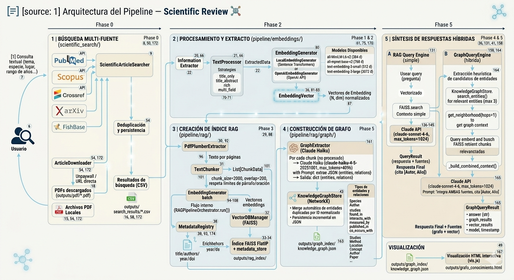

# Arquitectura del Pipeline — Scientific Review

**Última actualización:** Abril 2026
**Estado:** 5 fases completas + conectores BD · 208 tests (100% ✅) · ~6 000 líneas de código

---

## Resumen general

El proyecto implementa un pipeline de revisión científica automatizada en cinco fases encadenadas: desde la **búsqueda de artículos en APIs externas** hasta una **interfaz de consulta híbrida** que combina recuperación vectorial semántica (RAG) con un grafo de conocimiento (GraphRAG) y síntesis de respuestas vía Claude API.



---

## Fase 0 — Búsqueda multi-fuente (`scientific_search/`)

### Propósito
Recuperar metadatos de artículos científicos de múltiples APIs, filtrarlos por relevancia y opcionalmente descargar los PDFs en acceso abierto.

### Archivos
| Archivo | Clase / Función | Rol |
|---------|----------------|-----|
| `searcher.py` | `ScientificArticleSearcher` | Orquestador principal |
| `adapters.py` | `CrossrefAdapter`, `PubMedAdapter`, `ArxivAdapter`, `ScopusAdapter` | Un adaptador por API |
| `models.py` | `Article`, `SearchResult` | Modelos de datos |
| `registry.py` | `SearchRegistry` | Deduplicación y persistencia en CSV |
| `downloader.py` | `ArticleDownloader` | Descarga PDFs vía Unpaywall / URL directa |

### Entradas
| Entrada | Descripción |
|---------|-------------|
| `query` (str) | Término o frase de búsqueda |
| `sources` (list) | APIs a consultar: `crossref`, `pubmed`, `arxiv`, `scopus` |
| `max_results` (int) | Resultados por fuente (default: 20) |
| `year_start / year_end` (int) | Ventana temporal |
| `min_relevance` (float 0‑1) | Fracción mínima de términos de dominio en el título |
| `adapter_config` (dict) | API keys por adaptador (Scopus, ScienceDirect) |
| `secrets/scopus_apikey.txt` | Clave API de Elsevier (leída automáticamente) |

### Salidas
| Salida | Ubicación | Formato |
|--------|-----------|---------|
| Resultados de búsqueda | `outputs/search_results/<query>_<timestamp>.csv` | CSV |
| Log completo | `outputs/search_logs/<query>_<timestamp>_full_log.json` | JSON |
| PDFs descargados | `outputs/pdfs/*.pdf` | PDF |

### CLI principal
```bash
python buscar.py "Lutjanus peru population parameters Gulf of California"
python buscar.py "sardina" --lugar "Gulf of California" --sources scopus
python buscar.py "mako shark" --download --year-start 2018 --max-results 50
python buscar.py "reef fish" --download --index   # descarga + indexa en FAISS
```

---

## Fase 1 — Foundation (`pipeline/embeddings/`)

### Propósito
Limpiar y normalizar los metadatos de artículos antes de generar embeddings. Extrae campos clave y combina el texto según diferentes estrategias.

### Archivos
| Archivo | Clase | Rol |
|---------|-------|-----|
| `information_extractor.py` | `InformationExtractor` | Extrae y valida metadatos de un artículo |
| `text_processor.py` | `TextProcessor` | Normaliza y combina texto |
| `models.py` | `ExtractedData`, `EmbeddingVector`, `SearchResult` | Modelos de datos |

### Entradas
| Entrada | Tipo | Descripción |
|---------|------|-------------|
| Artículo crudo | `dict` | Diccionario con campos: `title`, `abstract`, `authors`, `year`, `doi`, `source` |

### Procesamiento (`TextProcessor`)
Cuatro estrategias de combinación de texto:

| Estrategia | Campos incluidos |
|------------|-----------------|
| `title_only` | Solo título |
| `title_abstract` | Título + abstract |
| `rich` | Título + abstract + keywords + autores (max 5) |
| `multi_field` | Campos separados (para modelos multi-encoder) |

Normalización aplicada: Unicode NFC, eliminación de HTML/URLs, eliminación de citas `[1]`, strip de espacios extra.

### Salidas
| Salida | Tipo | Descripción |
|--------|------|-------------|
| `ExtractedData` | dataclass | Metadatos limpios + `combined_text` listo para embedding |

---

## Fase 2 — Generación de embeddings (`pipeline/embeddings/`)

### Propósito
Convertir el texto combinado de cada artículo en un vector denso de alta dimensión para búsqueda semántica.

### Archivos
| Archivo | Clase | Rol |
|---------|-------|-----|
| `embedding_generator.py` | `EmbeddingGenerator` (ABC) | Interfaz base |
| `embedding_generator.py` | `LocalEmbeddingGenerator` | SentenceTransformers (CPU/GPU) |
| `embedding_generator.py` | `OpenAIEmbeddingGenerator` | API de OpenAI |
| `embedding_generator.py` | `get_embedding_generator()` | Factory |

### Modelos disponibles
| Proveedor | Modelo | Dimensiones |
|-----------|--------|-------------|
| Local ⭐ | `all-MiniLM-L6-v2` | 384 |
| Local | `all-mpnet-base-v2` | 768 |
| Local | `multilingual-e5-small` | 384 |
| OpenAI | `text-embedding-3-small` | 512 |
| OpenAI | `text-embedding-3-large` | 3 072 |
| OpenAI | `text-embedding-ada-002` | 1 536 |

### Entradas
| Entrada | Tipo | Descripción |
|---------|------|-------------|
| `text` / `texts` | `str` / `List[str]` | Texto(s) a embeddear |
| `provider` | `str` | `"local"` o `"openai"` |
| `model_name` | `str` | Nombre del modelo (ver tabla) |

### Salidas
| Salida | Tipo | Descripción |
|--------|------|-------------|
| `EmbeddingVector` | dataclass | Vector `np.ndarray` (dim,) + metadatos |
| Batch → | `np.ndarray` | Matriz (N, dim) normalizada a unit norm |

---

## Fase 3 — RAG Pipeline (`pipeline/rag/`)

### Propósito
Extraer texto de PDFs científicos, dividirlo en chunks solapados, generar embeddings y persistirlos en un índice FAISS para búsqueda de similitud coseno.

### Archivos
| Archivo | Clase | Rol |
|---------|-------|-----|
| `pdf_extractor.py` | `PdfPlumberExtractor` | Extrae texto por página de PDFs |
| `text_chunker.py` | `TextChunker` | Divide texto en chunks con overlap |
| `vector_db.py` | `VectorDBManager` | Índice FAISS FlatIP + metadata store |
| `rag_pipeline.py` | `RAGPipelineOrchestrator` | Orquesta los pasos anteriores |
| `metadata_registry.py` | `MetadataRegistry` | Vincula chunks con metadatos de CSVs |
| `models.py` | `ChunkData`, `ChunkVector`, `IndexStats` | Modelos de datos |

### Flujo interno (`RAGPipelineOrchestrator.run()`)
```
PDF (archivo .pdf)
  │
  ├─ PdfPlumberExtractor.extract_by_pages()
  │    Entrada : ruta al PDF
  │    Salida  : List[(page_num: int, text: str)]
  │
  ├─ TextChunker.chunk_pages()
  │    Entrada : List[(page, text)], chunk_size=2000, overlap=200
  │    Salida  : List[ChunkData]
  │              Respeta límites de párrafo y oración
  │
  ├─ EmbeddingGenerator.batch_generate()
  │    Entrada : List[str] (textos de chunks)
  │    Salida  : np.ndarray (N, 384)
  │
  └─ VectorDBManager.add_chunks()
       Entrada : List[ChunkData] + np.ndarray
       Salida  : índice FAISS actualizado (FlatIP, unit norm = coseno)
```

### Entradas
| Entrada | Descripción |
|---------|-------------|
| `outputs/pdfs/*.pdf` | PDFs descargados por `buscar.py` |
| `chunk_size` (int) | Tamaño máximo de chunk en caracteres (default: 2 000) |
| `overlap` (int) | Solapamiento entre chunks (default: 200) |
| `skip_indexed` (bool) | Omite PDFs ya indexados (idempotente, default: True) |

### Salidas
| Salida | Ubicación | Contenido |
|--------|-----------|-----------|
| Índice FAISS | `outputs/rag_index/index.faiss` | Vectores normalizados (FlatIP) |
| Metadata store | `outputs/rag_index/metadata_store.json` | `{faiss_id: ChunkData}` |
| Configuración | `outputs/rag_index/index_config.json` | Modelo, dimensión, fecha |

### CLI
```bash
python indexar.py                          # indexa outputs/pdfs/
python indexar.py --pdf-dir papers/        # directorio alternativo
python indexar.py --stats                  # estadísticas del índice
python indexar.py --list                   # papers ya indexados
python indexar.py --force                  # re-indexar todo
python indexar.py --enrich-metadata        # añadir título/autores/DOI desde CSVs
python indexar.py --chunk-size 1500        # chunks más pequeños
python indexar.py --provider openai        # embeddings con OpenAI
```

---

## Fase 4 — RAG Query Engine (`pipeline/rag/`)

### Propósito
Responder preguntas en lenguaje natural sobre el corpus indexado: vectoriza la pregunta, recupera los chunks más similares y genera una respuesta citada con Claude API.

### Archivos
| Archivo | Clase | Rol |
|---------|-------|-----|
| `query_engine.py` | `RAGQueryEngine` | Motor de consultas RAG |
| `metadata_registry.py` | `MetadataRegistry` | Enriquecimiento de chunks con metadatos de CSVs |
| `models.py` | `RAGSearchResult`, `QueryResult` | Modelos de resultado |

### Flujo interno (`RAGQueryEngine.query()`)
```
Pregunta (str)
  │
  ├─ EmbeddingGenerator.generate()
  │    Salida : vector 384-d normalizado
  │
  ├─ VectorDBManager.search(top_k=5, min_score=0.2)
  │    Salida : List[RAGSearchResult]
  │             (chunk_text, score, paper_id, page, title, authors, year, doi)
  │
  ├─ _build_context()
  │    Ensambla los chunks en un prompt de contexto numerado
  │
  └─ Claude API (claude-sonnet-4-6, max_tokens=1024)
       Prompt sistema: "responde SOLO desde el contexto, cita [Autor, Año]"
       Salida : QueryResult
                ├── answer    (str) respuesta en lenguaje natural
                ├── sources   (List[RAGSearchResult]) chunks usados
                ├── model     nombre del modelo
                └── timestamp datetime
```

### Entradas
| Entrada | Tipo | Descripción |
|---------|------|-------------|
| `question` | `str` | Pregunta en cualquier idioma |
| `top_k` | `int` | Chunks a recuperar de FAISS (default: 5) |
| `min_score` | `float` | Similitud coseno mínima (default: 0.2) |
| `ANTHROPIC_API_KEY` | env var | Clave para la API de Claude |

### Salidas
| Salida | Tipo | Descripción |
|--------|------|-------------|
| `QueryResult.answer` | `str` | Respuesta generada con fuentes citadas |
| `QueryResult.sources` | `List[RAGSearchResult]` | Chunks recuperados con metadatos |
| `QueryResult.format_answer()` | `str` | Respuesta + fuentes formateadas para terminal |

### CLI
```bash
python buscar_rag.py "¿Qué métodos predicen capturas de Lutjanus?"
python buscar_rag.py --interactive
python buscar_rag.py --stats
python buscar_rag.py --show-chunks "query"
```

---

## Fase 5 — GraphRAG (`pipeline/rag/graph/`)

### Propósito
Construir un grafo de conocimiento a partir de los chunks indexados (extrayendo entidades y relaciones con Claude Haiku) y habilitarlo como fuente adicional para consultas híbridas que combinan búsqueda vectorial + grafo + LLM.

### Archivos
| Archivo | Clase | Rol |
|---------|-------|-----|
| `models.py` | `Entity`, `Relation`, `GraphStats` | Modelos de datos del grafo |
| `models.py` | `GraphSearchResult`, `GraphQueryResult` | Resultados de consulta |
| `graph_store.py` | `KnowledgeGraphStore` | Backend NetworkX + persistencia JSON |
| `extractor.py` | `GraphExtractor` | Extracción vía Claude Haiku |
| `graph_query_engine.py` | `GraphQueryEngine` | Consulta híbrida grafo + FAISS + Claude Sonnet |

### Tipos de entidades y relaciones
**Entidades:** `Species` · `Method` · `Location` · `Concept` · `Author` · `Paper`

**Relaciones:** `studies` · `found_in` · `interacts_with` · `measured_by` · `published_in` · `co_occurs_with`

---

### Sub-componente A — `GraphExtractor`

#### Flujo (`GraphExtractor.extract_from_chunks()`)
```
List[ChunkData] (del índice FAISS)
  │
  └─ Por cada chunk (no procesado aún):
       │
       ├─ Claude Haiku (claude-haiku-4-5-20251001, max_tokens=4096)
       │    Prompt sistema: extrae JSON {entities, relations}
       │    Salida: dict con lista de entidades y relaciones
       │
       └─ KnowledgeGraphStore.add_entities() + add_relations()
            Merge de entidades duplicadas por ID normalizado
            Persistencia incremental en JSON
```

#### Entradas
| Entrada | Descripción |
|---------|-------------|
| `List[ChunkData]` | Chunks del índice FAISS (con `chunk_id`, `text`) |
| `force` (bool) | Re-procesar chunks ya procesados (default: False) |

#### Salidas
| Salida | Ubicación | Contenido |
|--------|-----------|-----------|
| Grafo JSON | `outputs/graph_index/knowledge_graph.json` | Entidades, relaciones, chunks procesados |
| Configuración | `outputs/graph_index/graph_config.json` | Modelo, fecha, estadísticas |

---

### Sub-componente B — `KnowledgeGraphStore`

- Backend: **NetworkX** (en memoria) + serialización JSON
- Cada nodo = `Entity` (id, tipo, nombre, aliases, fuentes)
- Cada arista = `Relation` (sujeto, relación, objeto, confianza, contexto)
- Operaciones: `add_entity`, `add_relation`, `search_entities` (fuzzy por nombre/alias), `get_neighborhood` (BFS a N hops), `get_stats`
- Merge automático de entidades con el mismo `entity_id` normalizado

---

### Sub-componente C — `GraphQueryEngine`

#### Flujo (`GraphQueryEngine.query()`)
```
Pregunta (str)
  │
  ├─ Extracción heurística de candidatos de entidades
  │    (tokens capitalizados, propios de dominio)
  │
  ├─ KnowledgeGraphStore.search_entities()
  │    → entidades relevantes (max: max_graph_entities=3)
  │
  ├─ get_neighborhood(hops=1)
  │    → vecindad del grafo para cada entidad
  │
  ├─ VectorDBManager.search(top_k=5, min_score=0.2)
  │    → chunks semánticos relevantes (FAISS)
  │
  ├─ _build_combined_context()
  │    Sección 1: grafo — entidades + relaciones
  │    Sección 2: fragmentos de texto de papers
  │
  └─ Claude API (claude-sonnet-4-6, max_tokens=1024)
       Prompt sistema: integra AMBAS fuentes, cita [Autor, Año]
       Salida: GraphQueryResult
               ├── answer       (str)
               ├── graph_results (List[GraphSearchResult])
               ├── vector_results (List[RAGSearchResult])
               └── model, timestamp
```

#### CLI de construcción y consulta
```bash
# Construir el grafo desde los chunks indexados
python construir_grafo.py
python construir_grafo.py --stats
python construir_grafo.py --force      # re-procesar todo
python construir_grafo.py --verbose

# Consultar con GraphRAG
python buscar_rag.py --graph "¿Dónde se ha encontrado Lutjanus peru?"
python buscar_rag.py --graph --graph-hops 2 "interacciones tróficas"

# Visualizar el grafo (HTML interactivo)
python visualizar_grafo.py                          # top-80 nodos
python visualizar_grafo.py --top 50
python visualizar_grafo.py --tipos Species Location
python visualizar_grafo.py --entidad "Lutjanus peru" --hops 2
python visualizar_grafo.py --todos
```

#### Salidas
| Salida | Ubicación | Contenido |
|--------|-----------|-----------|
| `GraphQueryResult` | (en memoria) | Respuesta + fuentes (grafo + vector) |
| Grafo HTML | `outputs/grafo_conocimiento.html` | Visualización interactiva (vis.js) |

---

## Orquestador del pipeline (`pipeline/`)

### Archivos de coordinación
| Archivo | Clase | Rol |
|---------|-------|-----|
| `pipeline_executor.py` | `PipelineExecutor` | Ejecuta fases en secuencia, valida config |
| `phase_runner.py` | `PhaseRunner`, `SearchPhase`, `AnalysisPhase`, … | Encapsula cada fase como objeto ejecutable |
| `logger.py` | `Logger` | Logging centralizado con soporte de resumen JSON |

### Flujo de ejecución (`PipelineExecutor.execute()`)
```
PipelineConfig (domain1, domain2, figures_dir, …)
  │
  ├─ validate_config()          → verifica campos requeridos y archivos de entrada
  │
  ├─ _get_phases_to_run()       → lista ordenada de PhaseRunner
  │
  ├─ Por cada phase:
  │    ├─ logger.start_phase()
  │    ├─ phase.run()           → bool (éxito/fallo)
  │    └─ logger.end_phase()
  │
  └─ logger.save_summary("pipeline_execution.json")
```

Fases disponibles: `SearchPhase` · `AnalysisPhase` · `DomainAnalysisPhase` · `ClassificationPhase` · `ReportPhase` · `TableExportPhase`

---

## Conectores de Bases de Datos (`database_connectors/`)

### Propósito
Recuperar parámetros poblacionales curados directamente desde bases de datos biológicas externas, complementando la literatura indexada en el RAG. Actualmente implementado para FishBase; diseñado para extenderse a OBIS, FishBase Sealifebase y otras fuentes.

### Archivos
| Archivo | Clase | Rol |
|---------|-------|-----|
| `base.py` | `DatabaseAdapter` | ABC con la interfaz común para todos los adaptadores |
| `models.py` | `SpeciesInfo` | Información taxonómica validada (SpecCode, familia, orden) |
| `models.py` | `PopulationParameter` | Un parámetro individual con valor, unidad, fuente y confianza |
| `models.py` | `ParameterSet` | Colección completa por especie con resumen para ATLANTIS |
| `fishbase_adapter.py` | `FishBaseAdapter` | Adaptador para la API pública de FishBase (rOpenSci) |
| `tests/test_fishbase.py` | — | 56 tests unitarios (HTTP mockeado) + 3 de integración |

### API de FishBase utilizada
El adaptador accede al endpoint público mantenido por rOpenSci — **no requiere API key**.

```
Base URL: https://fishbase.ropensci.org
```

| Tabla | Parámetros ATLANTIS | Columnas FishBase |
|-------|--------------------|--------------------|
| `popgrowth` | K · Linf · t0 | `K` · `Loo` · `to` |
| `poplw` | a · b | `a` · `b` · `Type` |
| `ecology` | TrophicLevel | `FoodTroph` |
| `maturity` | Lmat · Amat | `Lm` · `tm` |
| `popqb` | QB | `QB` |

### Flujo interno (`FishBaseAdapter.get_all_params()`)
```
species_name (str)
  │
  ├─ validate_species()          → SpeciesInfo (SpecCode, nombre aceptado, familia)
  │    Endpoint: /species?genus=X&species=Y
  │    Caché en instancia para evitar llamadas redundantes
  │
  ├─ _fetch_growth_params()      → List[PopulationParameter] (K, Linf, t0)
  │    Endpoint: /popgrowth?SpecCode=N
  │
  ├─ _fetch_lw_params()          → List[PopulationParameter] (a, b)
  │    Endpoint: /poplw?SpecCode=N
  │
  ├─ _fetch_ecology_params()     → List[PopulationParameter] (TrophicLevel)
  │    Endpoint: /ecology?SpecCode=N
  │
  ├─ _fetch_maturity_params()    → List[PopulationParameter] (Lmat, Amat)
  │    Endpoint: /maturity?SpecCode=N
  │
  ├─ _fetch_qb_params()          → List[PopulationParameter] (QB)
  │    Endpoint: /popqb?SpecCode=N
  │
  └─ ParameterSet
       ├── parameters   : todos los registros individuales
       ├── missing      : parámetros ATLANTIS sin cobertura en FishBase
       └── warnings     : advertencias (especie no resuelta, datos faltantes)
```

### Entradas
| Entrada | Tipo | Descripción |
|---------|------|-------------|
| `species_name` | `str` | Nombre científico (ej. `"Lutjanus peru"`) |
| `ecosystem` | `str` (opcional) | Filtra registros por localidad; si no hay coincidencia, retorna todos |

### Salidas
| Salida | Tipo | Descripción |
|--------|------|-------------|
| `SpeciesInfo` | dataclass | SpecCode, familia, orden, nombre aceptado, hábitat |
| `List[PopulationParameter]` | dataclass | Todos los registros con valor, unidad, método, n_muestras y fuente |
| `ParameterSet` | dataclass | Colección con `get_best(param)`, `to_summary_dict()` y lista de faltantes |

### Modelos de datos

**`PopulationParameter`** — un registro individual de un estudio:

| Campo | Tipo | Descripción |
|-------|------|-------------|
| `parameter` | `str` | Nombre ATLANTIS: `"K"`, `"Linf"`, `"TrophicLevel"`, etc. |
| `value` | `float` | Valor numérico del parámetro |
| `unit` | `str` | Unidad: `"yr⁻¹"`, `"cm"`, `"dimensionless"` |
| `n_samples` | `int` | Número de muestras del estudio (base de `get_best()`) |
| `locality` | `str` | Región geográfica del estudio |
| `sex` | `str` | `"male"` · `"female"` · `"combined"` (normalizado desde códigos FishBase) |
| `confidence` | `str` | `"curated"` (datos FishBase) · `"estimated"` · `"inferred"` |
| `data_ref` | `int` | ID interno de la referencia en FishBase |

**`ParameterSet.get_best(param)`** — selección del mejor registro:
Prioriza el registro con mayor `n_samples`. Si todos tienen `n_samples = None`, retorna el primero disponible.

**`ParameterSet.to_summary_dict()`** — resumen plano para exportar a CSV o ATLANTIS:
```python
{
  "species":             "Lutjanus peru",
  "K":                   0.18,
  "K_unit":              "yr⁻¹",
  "K_source":            "fishbase",
  "K_confidence":        "curated",
  "Linf":                52.3,
  ...
  "QB":                  None,           # parámetro no encontrado
  "QB_confidence":       "sin datos",
}
```

### Uso rápido
```python
from database_connectors import FishBaseAdapter

adapter = FishBaseAdapter()

# Validar especie y obtener SpecCode
info = adapter.validate_species("Lutjanus peru")
print(info)   # Lutjanus peru (Pacific red snapper) [SpecCode: 3839, Lutjanidae]

# Parámetros de crecimiento von Bertalanffy
params = adapter.get_growth_params("Lutjanus peru")
# → [K=0.18 yr⁻¹ [Gulf of California] — fishbase, Linf=52.3 cm ..., t0=...]

# Conjunto completo para ATLANTIS (todas las tablas)
pset = adapter.get_all_params("Lutjanus peru", ecosystem="Gulf of California")
print(pset)               # Lutjanus peru — 18 registros [K, Linf, a, b, TrophicLevel, ...]
print(pset.missing)       # ['t0', 'QB']  → parámetros sin datos en FishBase
print(pset.to_summary_dict())   # dict plano listo para CSV/ATLANTIS
```

---

## Mapa completo de archivos y directorios

```
scientific_review/
│
├── buscar.py                  CLI: búsqueda + descarga (Fase 0)
├── indexar.py                 CLI: indexado FAISS (Fase 3) + enriquecimiento
├── buscar_rag.py              CLI: consultas RAG / GraphRAG (Fases 4–5)
├── construir_grafo.py         CLI: construcción del grafo (Fase 5)
├── visualizar_grafo.py        CLI: visualización HTML del grafo
│
├── scientific_search/         Fase 0 — Búsqueda multi-fuente
│   ├── searcher.py            ScientificArticleSearcher
│   ├── adapters.py            CrossrefAdapter, PubMedAdapter, ArxivAdapter, ScopusAdapter
│   ├── models.py              Article, SearchResult
│   ├── registry.py            SearchRegistry (CSV + deduplicación)
│   └── downloader.py          ArticleDownloader (Unpaywall)
│
├── database_connectors/       Conectores a bases de datos biológicas
│   ├── __init__.py            Exports públicos del módulo
│   ├── base.py                DatabaseAdapter (ABC — interfaz común)
│   ├── models.py              SpeciesInfo · PopulationParameter · ParameterSet
│   ├── fishbase_adapter.py    FishBaseAdapter (API rOpenSci, sin API key)
│   └── tests/
│       ├── __init__.py
│       └── test_fishbase.py   56 tests unitarios + 3 de integración (red)
│
├── pipeline/
│   ├── logger.py              Logger centralizado
│   ├── phase_runner.py        PhaseRunner + fases del pipeline clásico
│   ├── pipeline_executor.py   PipelineExecutor (orquestador)
│   │
│   ├── embeddings/            Fases 1–2
│   │   ├── models.py          ExtractedData, EmbeddingVector, SearchResult
│   │   ├── information_extractor.py  InformationExtractor
│   │   ├── text_processor.py  TextProcessor (4 estrategias)
│   │   └── embedding_generator.py   Local + OpenAI + factory
│   │
│   └── rag/                   Fases 3–5
│       ├── models.py          ChunkData, ChunkVector, IndexStats, RAGSearchResult, QueryResult
│       ├── pdf_extractor.py   PdfPlumberExtractor
│       ├── text_chunker.py    TextChunker (sliding window, paragraph-aware)
│       ├── vector_db.py       VectorDBManager (FAISS FlatIP)
│       ├── rag_pipeline.py    RAGPipelineOrchestrator
│       ├── query_engine.py    RAGQueryEngine (Claude Sonnet)
│       ├── metadata_registry.py  MetadataRegistry (vincula CSV → chunks)
│       └── graph/             Fase 5 — GraphRAG
│           ├── models.py      Entity, Relation, GraphStats, GraphQueryResult
│           ├── graph_store.py KnowledgeGraphStore (NetworkX + JSON)
│           ├── extractor.py   GraphExtractor (Claude Haiku)
│           └── graph_query_engine.py  GraphQueryEngine
│
├── outputs/
│   ├── pdfs/                  PDFs científicos descargados
│   ├── search_results/        CSVs de resultados de búsqueda
│   ├── search_logs/           Logs JSON completos de búsqueda
│   ├── rag_index/             Índice FAISS + metadata_store.json
│   ├── graph_index/           Grafo de conocimiento JSON
│   └── *.html                 Visualizaciones interactivas del grafo
│
└── secrets/
    ├── anthropic-apikey       API key de Claude
    ├── scopus_apikey.txt      API key de Elsevier (Scopus)
    └── sciencedirect_apikey.txt
```

---

## Flujo de datos de extremo a extremo

```
[1] Consulta textual
         │
         ▼
[2] ScientificArticleSearcher
    ├─ Crossref API  ──┐
    ├─ PubMed API   ──┤─→ List[Article] → deduplicación → outputs/search_results/*.csv
    ├─ arXiv API    ──┤
    └─ Scopus API   ──┘
         │
         ▼
[3] ArticleDownloader
    Unpaywall / URL directa → outputs/pdfs/*.pdf
         │
         ▼
[4] PdfPlumberExtractor
    PDF → List[(page, text)]
         │
         ▼
[5] TextChunker
    [(page, text)] → List[ChunkData]
    chunk_id · paper_id · text · page · char_start · char_end
         │
         ▼
[6] LocalEmbeddingGenerator (all-MiniLM-L6-v2)
    List[str] → np.ndarray (N, 384) normalizado
         │
         ▼
[7] VectorDBManager
    np.ndarray → FAISS FlatIP index
    outputs/rag_index/index.faiss
    outputs/rag_index/metadata_store.json
         │
         ▼
[8] MetadataRegistry (opcional)
    outputs/search_results/*.csv → enriquece chunks con title/authors/year/doi
         │
         ▼
[9] GraphExtractor (Fase 5, a demanda)
    ChunkData → Claude Haiku → {entities, relations}
    → KnowledgeGraphStore → outputs/graph_index/knowledge_graph.json
         │
         ▼
[10] Consulta del usuario (pregunta)
         │
         ├──── RAGQueryEngine ─────────────────────────────────────────────┐
         │     embed(pregunta) → FAISS.search → _build_context             │
         │     → Claude Sonnet → QueryResult(answer, sources)              │
         │                                                                  │
         └──── GraphQueryEngine ──────────────────────────────────────────┐│
               candidatos → graph.search_entities → get_neighborhood      ││
               + FAISS.search → _build_combined_context                   ││
               → Claude Sonnet → GraphQueryResult(answer, graph, vector) ◄┘│
                                                                           ◄┘

[PARALELO — Parametrización ATLANTIS]

Lista de especies (CSV)
         │
         ▼
[A] FishBaseAdapter.validate_species()
    Nombre científico → SpeciesInfo (SpecCode, familia, nombre aceptado)
    Endpoint: https://fishbase.ropensci.org/species
         │
         ├─ get_growth_params()   → K · Linf · t0   (/popgrowth)
         ├─ get_length_weight()   → a · b            (/poplw)
         ├─ get_trophic_level()   → TrophicLevel     (/ecology)
         ├─ get_maturity_params() → Lmat · Amat      (/maturity)
         └─ get_qb_ratio()        → QB               (/popqb)
                   │
                   ▼
[B] ParameterSet
    ├── parameters   : List[PopulationParameter]  (todos los estudios)
    ├── missing      : List[str]  (parámetros sin datos en FishBase)
    └── to_summary_dict() → dict plano para CSV / ATLANTIS
                   │
                   ├── Si faltan parámetros → activar RAGQueryEngine [10]
                   │   con queries estructuradas por parámetro y especie
                   │
                   └── Salida consolidada: atlantis_params.csv
                       (valor · unidad · fuente · confianza por parámetro)
```

---

## Dependencias externas

| Paquete | Versión mínima | Uso |
|---------|---------------|-----|
| `numpy` | ≥ 1.24 | Vectores y operaciones matriciales |
| `requests` | ≥ 2.28 | Llamadas a APIs externas |
| `torch` | ≥ 2.0 | Backend de SentenceTransformers |
| `sentence-transformers` | ≥ 2.2 | Embeddings locales |
| `faiss-cpu` | ≥ 1.7 | Índice vectorial de similitud coseno |
| `pdfplumber` | ≥ 0.10 | Extracción de texto de PDFs |
| `anthropic` | ≥ 0.94 | Claude API (query engine + extractor) |
| `networkx` | ≥ 3.0 | Backend del grafo de conocimiento |
| `pyvis` | ≥ 0.3 | Visualización HTML interactiva |

---

## Comandos de operación

### Pipeline completo (búsqueda → indexado → consulta)
```bash
# 1. Buscar y descargar papers
python buscar.py "Lutjanus peru Gulf of California" --download --year-start 2015

# 2. Indexar PDFs descargados en FAISS
python indexar.py
python indexar.py --enrich-metadata   # añadir metadatos desde CSVs

# 3. Construir grafo de conocimiento (opcional)
python construir_grafo.py

# 4. Consultar (RAG simple)
python buscar_rag.py "¿Qué métodos de captura se usan para Lutjanus peru?"

# 4b. Consultar (GraphRAG: grafo + vectorial)
python buscar_rag.py --graph "¿Dónde se distribuye Lutjanus peru?"

# 5. Visualizar el grafo
python visualizar_grafo.py --entidad "Lutjanus peru" --hops 2
```

### Tests
```bash
python -m unittest discover               # todos los tests (208)
python -m unittest test_pipeline.py       # test específico del pipeline
python -m unittest database_connectors/tests/test_fishbase.py  # tests FishBase (56)
```

---

## Sugerencias de mejora

Las siguientes propuestas extienden las capacidades actuales del pipeline abordando limitaciones identificadas en cada componente. Están ordenadas por área de impacto.

---

### 1. Refinamiento en la recuperación — Reranking

**Limitación actual:** `RAGQueryEngine` pasa los 5 resultados mejor puntuados por FAISS directamente al contexto de Claude, usando únicamente similitud coseno como criterio de relevancia.

**Mejora propuesta — Reranker de dos etapas**

Insertar una fase de re-clasificación entre la búsqueda vectorial y la llamada al LLM:

```
Pregunta (str)
  │
  ├─ VectorDBManager.search(top_k=20)   ← ampliar el pool inicial
  │
  ├─ Reranker.rerank(pregunta, chunks)  ← NUEVA FASE
  │    Opciones:
  │    · Cohere Rerank API  (modelo `rerank-english-v3.0`)
  │    · BGE-Reranker-Large (local, HuggingFace)
  │    · cross-encoder/ms-marco-MiniLM-L-6-v2 (ligero, local)
  │    Salida: chunks reordenados por relevancia semántica real
  │
  └─ _build_context(top_k=5)            ← tomar solo los 5 mejores del reranker
```

El reranker evalúa el par *(pregunta, chunk)* de forma conjunta —a diferencia del embedding que evalúa cada pieza por separado— lo que reduce significativamente los falsos positivos por similitud superficial. La clase `RAGQueryEngine` puede extenderse con un parámetro `reranker=None` para que sea opcional y retrocompatible.

---

### 2. Optimización del Grafo de Conocimiento — Fase 5

**Limitación actual:** El merge de entidades en `KnowledgeGraphStore` opera por ID normalizado, lo que no resuelve sinónimos ni variantes léxicas que el LLM no agrupe explícitamente.

#### 2a. Entity Linking a bases de datos externas

Conectar las entidades extraídas con vocabularios controlados externos para evitar nodos duplicados semánticamente equivalentes (p. ej. _"Lutjanus peru"_ vs. _"Pargo raicero"_):

| Base de datos | Tipo de entidad | API |
|---------------|----------------|-----|
| Wikidata | Conceptos generales, autores | `wikidata.org/w/api.php` |
| FishBase / Catalogue of Life | Especies marinas | `fishbase.se/api` |
| NCBI Taxonomy | Taxonomía biológica | `eutils.ncbi.nlm.nih.gov` |

El flujo propuesto en `GraphExtractor` sería:

```python
# Tras extraer la entidad con Claude Haiku:
entity_id_ext = entity_linker.lookup(entity.name, entity.type)
if entity_id_ext:
    entity.external_id = entity_id_ext   # URI canónico
    entity.aliases += entity_linker.get_aliases(entity_id_ext)
```

Esto permitiría que `KnowledgeGraphStore.search_entities()` encuentre _"Pargo raicero"_ aunque el usuario escriba _"Lutjanus peru"_.

#### 2b. Detección de comunidades temáticas

Implementar algoritmos de clustering sobre el grafo para agrupar nodos por afinidad temática y habilitar consultas de alto nivel:

```python
# En KnowledgeGraphStore:
import community as community_louvain   # python-louvain
partition = community_louvain.best_partition(graph.to_undirected())
# Alternativa de mayor resolución:
# from leidenalg import find_partition, ModularityVertexPartition

graph.add_node_attribute("community_id", partition)
```

Esto permitiría consultas como _"¿Cuáles son los temas principales de la literatura?"_ respondidas a nivel de comunidad en lugar de buscar solo vecindades de un nodo concreto.

---

### 3. Procesamiento de documentos más completo

**Limitación actual:** `PdfPlumberExtractor` opera únicamente sobre el texto extraído de cada página; las figuras, gráficos y tablas con formato complejo se pierden o se extraen de forma degradada.

#### 3a. Multimodalidad — Vision RAG

Integrar un modelo de visión para analizar el contenido gráfico de los papers:

```
PDF
  │
  ├─ PdfPlumberExtractor   → texto por página  (flujo actual)
  │
  └─ PdfImageExtractor     → imágenes por página  (NUEVA rama)
       │  (pdf2image / pdfplumber.Page.images)
       │
       └─ VisionAnalyzer (Claude claude-sonnet-4-6 con vision)
            Prompt: "Describe esta figura/tabla en términos científicos"
            Salida: descripción textual → se añade como ChunkData adicional
```

Esto haría que tablas de datos, gráficas de captura y mapas de distribución geográfica también sean recuperables por RAG.

#### 3b. Chunking estructural por sección

Extender `TextChunker` para reconocer la estructura IMRaD de los artículos científicos:

```python
SECTION_HEADERS = {
    "introduction": r"(?i)^(1\.?\s*)?introduc",
    "methods":      r"(?i)^(2\.?\s*)?(material|method|metodolog)",
    "results":      r"(?i)^(3\.?\s*)?results?|resultados",
    "discussion":   r"(?i)^(4\.?\s*)?discuss|discus",
    "conclusion":   r"(?i)^(5\.?\s*)?conclus",
}
# ChunkData extendido:
@dataclass
class ChunkData:
    ...
    section: str = "unknown"   # NUEVA campo
```

Con esto, `RAGQueryEngine.query()` podría recibir un parámetro `filter_section="methods"` y responder solo desde la sección de metodología, reduciendo el ruido en consultas especializadas.

---

### 4. Interfaz y experiencia de usuario

**Limitación actual:** Cada sesión de `buscar_rag.py --interactive` es independiente; no existe historial persistente ni exportación de referencias en formatos bibliográficos estándar.

#### 4a. Persistencia de sesiones de consulta

Crear una base de datos local (SQLite es suficiente para el volumen actual) para almacenar el historial de consultas, respuestas y fuentes:

```python
# pipeline/rag/session_store.py
class SessionStore:
    def save_query(self, question: str, result: QueryResult) -> str:
        """Guarda consulta y retorna session_id."""
    def load_session(self, session_id: str) -> List[QueryResult]:
        """Recupera historial completo de una sesión."""
    def get_context_window(self, session_id: str, last_n: int = 5) -> str:
        """Devuelve las últimas N respuestas como contexto adicional."""
```

El `RAGQueryEngine` podría recibir un `session_id` opcional para incluir el historial en el prompt, habilitando conversaciones multi-turno sobre el mismo corpus sin re-indexar.

#### 4b. Dashboard de exportación de citas

Añadir un módulo que convierta `QueryResult.sources` a formatos estándar de gestores bibliográficos:

```python
# pipeline/rag/citation_exporter.py
class CitationExporter:
    def to_bibtex(self, sources: List[RAGSearchResult]) -> str:
        """Genera entradas @article{...} en formato BibTeX."""
    def to_ris(self, sources: List[RAGSearchResult]) -> str:
        """Genera entradas en formato RIS (Zotero, Mendeley, EndNote)."""
    def to_apa(self, sources: List[RAGSearchResult]) -> str:
        """Genera lista de referencias en estilo APA 7."""
```

```bash
# Uso propuesto:
python buscar_rag.py "Lutjanus peru" --export-citations bibtex > referencias.bib
python buscar_rag.py "Lutjanus peru" --export-citations ris    > referencias.ris
```

---

### 5. Escalabilidad técnica

**Limitación actual:** `VectorDBManager` usa un índice FAISS `FlatIP` plano en memoria, lo que es óptimo para corpus pequeños pero no escala bien a decenas de miles de artículos.

#### 5a. Migración a una base de datos vectorial distribuida

| Solución | Ventaja principal | Caso de uso |
|----------|------------------|-------------|
| **Pinecone** | Serverless, sin infraestructura | Prototipado rápido en nube |
| **Weaviate** | Híbrido BM25 + vector, auto-hosting | Control total, sin costo por consulta |
| **Milvus** | Mayor throughput, índices IVF/HNSW | Corpus > 100 k chunks |
| **Qdrant** | Filtrado por metadatos nativo | Filtros por año, fuente, dominio |

La interfaz `VectorDBManager` ya abstrae las operaciones `add_chunks` / `search` / `save` / `load`, por lo que una implementación alternativa (`WeaviateDBManager`, `MilvusDBManager`) podría inyectarse en `RAGPipelineOrchestrator` y `RAGQueryEngine` sin modificar el resto del pipeline.

#### 5b. Cuantización de embeddings

Para reducir el uso de RAM y acelerar la búsqueda cuando el índice crece:

```python
# En VectorDBManager, al construir el índice:
import faiss

# Opción A — Cuantización escalar (SQ8): reduce 4× la memoria, pérdida mínima
index_base = faiss.IndexFlatIP(dimension)
index = faiss.IndexScalarQuantizer(dimension, faiss.ScalarQuantizer.QT_8bit_uniform,
                                   faiss.METRIC_INNER_PRODUCT)

# Opción B — Product Quantization (PQ): reduce 8–32×, adecuado para > 1 M vectores
index = faiss.IndexPQ(dimension, m=32, nbits=8)

# Opción C — HNSW (grafo jerárquico): búsqueda sub-lineal sin cuantizar
index = faiss.IndexHNSWFlat(dimension, 32)   # 32 = M (conexiones por nodo)
```

Se recomienda evaluar la pérdida de precisión (recall@5) antes de cambiar de `FlatIP` a cualquier índice aproximado, especialmente con corpus de dominio especializado como el presente.
