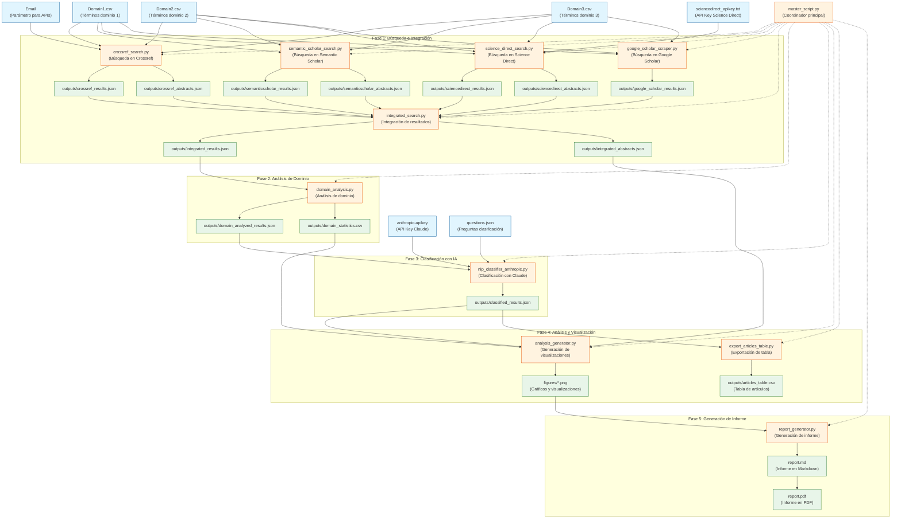

```mermaid
flowchart TD
    %% Definición de estilos
    classDef inputFile fill:#e1f5fe,stroke:#01579b
    classDef outputFile fill:#e8f5e9,stroke:#2e7d32
    classDef scriptNode fill:#fff3e0,stroke:#e65100
    classDef systemNode fill:#f3e5f5,stroke:#6a1b9a
    
    %% Nodos de archivos de entrada
    Domain1["Domain1.csv<br>(Términos dominio 1)"]:::inputFile
    Domain2["Domain2.csv<br>(Términos dominio 2)"]:::inputFile
    Domain3["Domain3.csv<br>(Términos dominio 3)"]:::inputFile
    APIKey["anthropic-apikey<br>(API Key Claude)"]:::inputFile
    ScienceAPIKey["sciencedirect_apikey.txt<br>(API Key Science Direct)"]:::inputFile
    Email["Email<br>(Parámetro para APIs)"]:::inputFile
    Questions["questions.json<br>(Preguntas clasificación)"]:::inputFile
    
    %% Nodos de scripts principales
    master_script["master_script.py<br>(Coordinador principal)"]:::scriptNode
    
    %% Fase 1: Búsqueda
    subgraph "Fase 1: Búsqueda e Integración"
        crossref["crossref_search.py<br>(Búsqueda en Crossref)"]:::scriptNode
        semantic["semantic_scholar_search.py<br>(Búsqueda en Semantic Scholar)"]:::scriptNode
        science["science_direct_search.py<br>(Búsqueda en Science Direct)"]:::scriptNode
        google["google_scholar_scraper.py<br>(Búsqueda en Google Scholar)"]:::scriptNode
        integrate["integrated_search.py<br>(Integración de resultados)"]:::scriptNode
        
        crossref_results["outputs/crossref_results.json"]:::outputFile
        crossref_abstracts["outputs/crossref_abstracts.json"]:::outputFile
        semantic_results["outputs/semanticscholar_results.json"]:::outputFile
        semantic_abstracts["outputs/semanticscholar_abstracts.json"]:::outputFile
        science_results["outputs/sciencedirect_results.json"]:::outputFile
        science_abstracts["outputs/sciencedirect_abstracts.json"]:::outputFile
        google_results["outputs/google_scholar_results.json"]:::outputFile
        integrated_results["outputs/integrated_results.json"]:::outputFile
        integrated_abstracts["outputs/integrated_abstracts.json"]:::outputFile
    end
    
    %% Fase 2: Análisis de dominio
    subgraph "Fase 2: Análisis de Dominio"
        domain_analysis["domain_analysis.py<br>(Análisis de dominio)"]:::scriptNode
        domain_results["outputs/domain_analyzed_results.json"]:::outputFile
        domain_stats["outputs/domain_statistics.csv"]:::outputFile
    end
    
    %% Fase 3: Clasificación
    subgraph "Fase 3: Clasificación con IA"
        nlp_classifier["nlp_classifier_anthropic.py<br>(Clasificación con Claude)"]:::scriptNode
        classified_results["outputs/classified_results.json"]:::outputFile
    end
    
    %% Fase 4: Análisis y Visualización
    subgraph "Fase 4: Análisis y Visualización"
        analysis_gen["analysis_generator.py<br>(Generación de visualizaciones)"]:::scriptNode
        export_table["export_articles_table.py<br>(Exportación de tabla)"]:::scriptNode
        
        figures["figures/*.png<br>(Gráficos y visualizaciones)"]:::outputFile
        articles_table["outputs/articles_table.csv<br>(Tabla de artículos)"]:::outputFile
    end
    
    %% Fase 5: Reporte
    subgraph "Fase 5: Generación de Informe"
        report_gen["report_generator.py<br>(Generación de informe)"]:::scriptNode
        
        report_md["report.md<br>(Informe en Markdown)"]:::outputFile
        report_pdf["report.pdf<br>(Informe en PDF)"]:::outputFile
    end
    
    %% Flujo de datos para búsqueda
    Domain1 --> crossref & semantic & science & google
    Domain2 --> crossref & semantic & science & google
    Domain3 --> crossref & semantic & science & google
    Email --> crossref
    ScienceAPIKey --> science
    
    crossref --> crossref_results & crossref_abstracts
    semantic --> semantic_results & semantic_abstracts
    science --> science_results & science_abstracts
    google --> google_results
    
    crossref_results & semantic_results & science_results & google_results --> integrate
    crossref_abstracts & semantic_abstracts & science_abstracts --> integrate
    
    integrate --> integrated_results & integrated_abstracts
    
    %% Flujo para análisis de dominio
    integrated_results --> domain_analysis
    domain_analysis --> domain_results & domain_stats
    
    %% Flujo para clasificación
    domain_results --> nlp_classifier
    Questions --> nlp_classifier
    APIKey --> nlp_classifier
    nlp_classifier --> classified_results
    
    %% Flujo para análisis y visualización
    classified_results --> analysis_gen & export_table
    integrated_abstracts --> analysis_gen
    domain_stats --> analysis_gen
    
    analysis_gen --> figures
    export_table --> articles_table
    
    %% Flujo para reporte
    figures --> report_gen
    report_gen --> report_md --> report_pdf
    
    %% Conexión con master script
    master_script -.-> crossref & semantic & science & google
    master_script -.-> integrate
    master_script -.-> domain_analysis
    master_script -.-> nlp_classifier
    master_script -.-> analysis_gen & export_table
    master_script -.-> report_gen
```